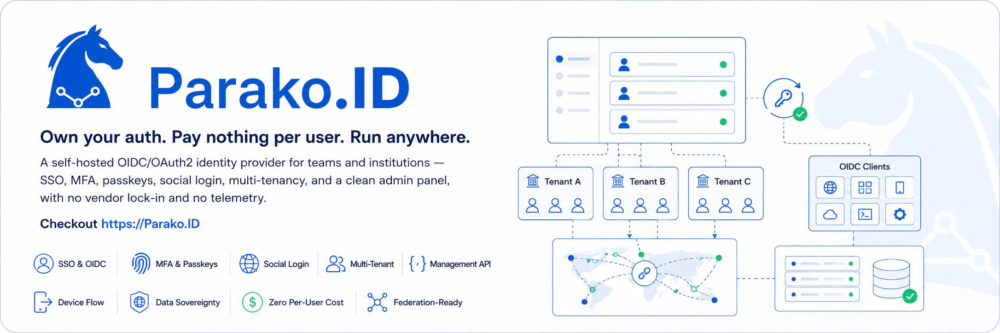

<!-- omit in toc -->



# Parako.ID

> **Identity infrastructure you own.**

Open-source, self-hosted authentication and authorization for teams that need
standards-based SSO without per-user pricing or surrendering control of their
identity data.

[](./LICENSE)
[](https://nodejs.org)
[](https://pnpm.io)
[](https://github.com/Dahkenangnon/Parako.ID/releases)

[Website](https://parako.id) · [Documentation](./docs/introduction.md) · [Quickstart](./docs/quickstart.md) · [Releases](https://github.com/Dahkenangnon/Parako.ID/releases) · [Security](./SECURITY.md)

> [!WARNING]
> Parako.ID is early-access software under active development. APIs,
> configuration, and upgrade contracts may change before v1.0. Evaluate it in
> a non-production environment before connecting a product.

Parako.ID is an OpenID Connect and OAuth 2.0 identity provider for web, mobile,
API, CLI, and device applications. It combines modern sign-in, tenant-aware
identity, branded experiences, an administration panel, and production
lifecycle tooling in one deployment—while users, sessions, keys, grants,
audit logs, and configuration remain inside infrastructure you control.

It is built on the OpenID Certified [`node-oidc-provider`](https://github.com/panva/node-oidc-provider) library. Parako.ID itself has not undergone OpenID Foundation certification.

## Why Parako.ID

Managed auth is convenient until user count, data residency, tenant isolation, low-connectivity users, or institution-specific identifiers become business requirements. Parako.ID gives you a standards-based identity server that starts with SQLite, runs on your own Linux host, and can grow into a multi-tenant control plane backed by MongoDB, PostgreSQL, and Redis.

| Need                            | What Parako.ID gives you                                                                                    |
| ------------------------------- | ----------------------------------------------------------------------------------------------------------- |
| Avoid per-user pricing          | Flat infrastructure cost instead of MAU-based hosted-auth bills                                             |
| Own identity data               | Users, password hashes, sessions, JWKS, grants, audit logs, and tenant config stay in your database         |
| Serve unreliable networks       | Server-rendered login, account, and admin screens built to remain practical on 2G/3G-style links            |
| Start without database ceremony | SQLite default for local development, evaluation, and small single-process deployments                      |
| Scale the storage model         | MongoDB or PostgreSQL for production, with Redis-backed sessions, OIDC storage, cache, and background jobs  |
| Run many organizations          | Tenant isolation, per-tenant branding/config/OIDC provider instances, subdomain or header tenant resolution |
| Support local identity patterns | Email, phone, username, and custom identifiers such as employee IDs or student matricule numbers            |

## Core Capabilities

### Own Your Identity Data

Use Parako.ID when identity data needs to stay close to the organization that is responsible for it. User records, password hashes, MFA state, recovery settings, sessions, OIDC grants, signing keys, tenant configuration, and audit activity are stored in the database you choose and operate.

### Standards-First SSO/OIDC

Parako.ID speaks OAuth2 and OpenID Connect through `node-oidc-provider`: authorization code + PKCE, discovery, JWKS, access and refresh tokens, token introspection, revocation, device flow, resource indicators, dynamic client registration, and RP-initiated logout. Use it for web apps, mobile apps, APIs, CLIs, machine clients, and device-style flows.

### Authentication That Fits Real Users

Support email, phone, username, and custom-identifier login from the same deployment. Passwords use Argon2id, breach-password checks use Have I Been Pwned k-anonymity, and accounts can be protected with new-device verification, multi-account browser sessions, TOTP, email OTP, SMS OTP, backup codes, security questions, and WebAuthn/FIDO2 passkeys.

### Low-Bandwidth Friendly by Design

Parako.ID does not make authentication depend on a heavy SPA bundle. Auth, account, and admin flows are server-rendered with Nunjucks and enhanced with small client-side behavior, so core identity workflows remain usable on slower 2G and 3G connections, low-end devices, shared Wi-Fi, and institution networks where bandwidth is unreliable.

### Multi-Database Support

Choose the storage model that matches your stage:

| Database   | Best fit                                  | Notes                                             |
| ---------- | ----------------------------------------- | ------------------------------------------------- |
| SQLite     | Local development, evaluation, small apps | Zero external DB; single-process only             |
| MongoDB    | Production and multi-tenant deployments   | Tenant scoping via Mongoose plugin                |
| PostgreSQL | Production with strict relational data    | Prisma-based, with row-level security for tenants |

SQLite is the easiest starting point. Multi-tenancy requires MongoDB or PostgreSQL.

### Multi-Tenancy Built In

Run one Parako.ID instance for many organizations. Each tenant can have isolated data, sessions, OIDC provider instances, branding, security policy, social-provider config, notifications, and token settings. Tenant resolution supports subdomains and headers, with `_platforms` for platform administration and `_ops` for infrastructure callback routing.

### Admin Panel, CLI, and Management API

Manage users, OIDC clients, sessions, grants, JWKS keys, activities, settings, tenants, imports, exports, and platform configuration from the admin panel. Automate the same operational work through the Management API with scoped permissions, or use CLI tools for clients, keys, updates, and service helpers.

### Emerging-Market Friendly Defaults

Parako.ID is practical for environments where identity systems must work with constrained infrastructure and mixed user devices: SQLite for a low-friction start, server-rendered pages for low bandwidth, phone and custom identifiers for local login patterns, SMS/email recovery options, and 10 included locales for international deployments.

### Operator-Controlled Deployment

Architecture-specific releases bundle Node.js, production dependencies, migrations, backup encryption tools, an SPDX SBOM, and a compatibility manifest. The installer verifies and atomically activates them; the `parako` CLI manages bootstrap secrets, migrations, encrypted backup/restore, hardened systemd services, health diagnostics, updates, and rollback safety. Application and OIDC settings stay in the admin panel, while your team retains control of the database and Redis services, HTTPS ingress, DNS, monitoring, and off-host backup storage.

## Built For Operators

Parako.ID is infrastructure you control, not a black-box auth tenant. The application handles identity workflows, OIDC protocol behavior, tenant-aware configuration, admin surfaces, and release staging. You keep ownership of the operational pieces that define your production posture.

| Parako.ID manages                                  | You own and control                                   |
| -------------------------------------------------- | ----------------------------------------------------- |
| OIDC/OAuth2 behavior, users, sessions, and grants  | Database and Redis provisioning, access, and scaling  |
| Admin UI, application configuration, and clients   | Reverse proxy, DNS, certificates, and public ingress  |
| Signed releases, migrations, and systemd lifecycle | Monitoring, incident response, and upgrade timing     |
| Encrypted host backup/restore and rollback checks  | Off-host retention, restore drills, and recovery SLOs |

## What You Can Build With It

- A self-hosted SSO layer for internal tools and customer apps.
- A tenant-aware identity platform for SaaS products.
- A school, company, or government login system using institutional IDs.
- A low-bandwidth authentication portal for users on unreliable networks.
- A standards-based OAuth2/OIDC server with local data control.
- A private alternative to hosted identity platforms when vendor lock-in, data locality, or pricing control is unacceptable.

## Install

Install the latest release on a Linux host:

```bash
curl --proto '=https' --tlsv1.2 -fsSL https://get.parako.id | sudo bash
```

The installer places a verified self-contained release and installs the `parako` production operator. A separate [commit-pinned Git distribution](./docs/installer-from-source.md) provides the same immutable layout and lifecycle for source-build environments. The signed native release remains the recommended default. Follow the [quickstart](./docs/quickstart.md), [installer](./docs/installer.md), and [deployment](./docs/deployment.md) runbooks to configure dependencies, deploy systemd services, and create the first administrator.

For local development:

```bash
git clone https://github.com/Dahkenangnon/Parako.ID.git
cd Parako.ID
pnpm install --frozen-lockfile
pnpm setup:dev
pnpm dev
```

`setup:dev` creates local runtime files with fresh secrets and applies the
SQLite migrations without overwriting existing operator configuration. Open
`http://localhost:9007/auth/register`, create the first user, then visit
`/admin` to register your first OIDC client. See the
[contributor guide](./CONTRIBUTING.md) for the unit, integration, and browser
test commands.

## Requirements

- Debian 12/13 or Ubuntu 24.04/26.04 on x86_64 or AArch64.
- Node.js >= 24 and pnpm >= 11 for source checkouts; releases bundle Node.js.
- SQLite by default, or a complete working MongoDB/PostgreSQL URI supplied by the operator.
- Operator-managed Redis, defaulting to `127.0.0.1:6379`.
- An external HTTPS reverse proxy or load balancer for public deployments.
- Optional SMTP/Twilio/social-provider credentials depending on enabled features.

## Project Status

Parako.ID is early-access open source infrastructure. The core identity server, admin UI, storage adapters, multi-tenancy foundation, installer, and management surfaces are active. OpenID Federation 1.0 work is in progress through the standalone [oidfed](https://github.com/Dahkenangnon/oidfed) library.

## Contributing

Pull requests are welcome. See [CONTRIBUTING.md](./CONTRIBUTING.md) for development setup, commit conventions, and review expectations.

## Security

Report vulnerabilities privately to <dah.kenangnon@gmail.com>. See [SECURITY.md](./SECURITY.md) for the disclosure policy.

## License

[MIT](./LICENSE) © [Justin Dah-kenangnon](https://github.com/Dahkenangnon)
